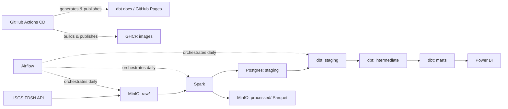
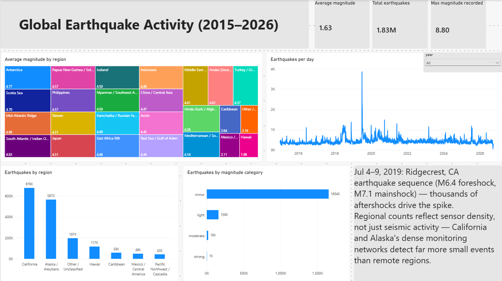

# USGS Earthquake Data Pipeline

An end-to-end, self-hosted data engineering pipeline that ingests global earthquake
data from the USGS API, processes it through Spark, models it with dbt, orchestrates
it daily with Airflow, and serves it through a Power BI report — with CI/CD publishing
Docker images and documentation automatically.

**Live Power BI report:** [dashboard](https://app.powerbi.com/view?r=eyJrIjoiOTM4ZDM1MGYtOThhMy00NTU5LWI4OGYtNTA5MTQ0M2IwM2VhIiwidCI6ImRiZDY2NjRkLTRlYjktNDZlYi05OWQ4LTVjNDNiYTE1M2M2MSIsImMiOjl9)
**dbt docs site:** [dbt docs](https://tammem-benyoussef.github.io/earthquake-pipeline/#!/overview)
**GHCR images:**
[earthquake-ingestion](https://github.com/tammem-benyoussef/earthquake-pipeline/pkgs/container/earthquake-ingestion) ·
[earthquake-spark](https://github.com/tammem-benyoussef/earthquake-pipeline/pkgs/container/earthquake-spark) ·
[dbt-earthquakes](https://github.com/tammem-benyoussef/earthquake-pipeline/pkgs/container/dbt-earthquakes)

---

## Why self-hosted

This project runs entirely on a single local machine via Docker Compose — no cloud
provider. That's a deliberate constraint, not an oversight: no cloud account with
billing enabled was available for this project. Every architectural decision below
(Terraform provisioning *local* infrastructure instead of cloud resources, Airflow
orchestrating locally rather than on an always-on server, GitHub Actions cron as the
actual production scheduler) follows from that one constraint, and is called out
explicitly where it matters rather than presented as if cloud infrastructure were
available.

---

## Architecture



| Stage | Tool | Purpose |
|---|---|---|
| Ingestion | Python (`click`, `boto3`) | Fetch daily earthquake records from USGS, write raw CSVs |
| Raw storage | MinIO | S3-compatible object storage for raw and processed data |
| Processing | Apache Spark 4.2.0 | Clean, dedupe, enrich, partition, load to Postgres |
| Warehouse | PostgreSQL 16 | Staging, intermediate, and mart schemas |
| Transformation | dbt (dbt-core 1.12.5) | Staging → intermediate → marts modeling, tests, docs |
| Orchestration | Apache Airflow 2.10.5 (LocalExecutor) | Daily ingest → process → build DAG |
| Infra-as-code | Terraform | Provisions MinIO buckets and Postgres schemas |
| CI | GitHub Actions | pytest, `dbt parse`, Airflow DAG validation |
| CD | GitHub Actions | Builds/pushes Docker images to GHCR, publishes dbt docs to GitHub Pages |
| BI | Power BI | Single-page report, published to web |

---

## Pipeline, stage by stage

### 1. Ingestion

`ingestion/daily_fetch.py` is a `click` CLI built around one function,
`fetch_earthquakes(start_date, end_date)`, used identically by both the daily job
and the historical backfill — the only difference between them is the width of the
date range passed in. Ingestion stays deliberately "dumb": it writes raw USGS CSV
text straight to storage with no parsing, leaving all transformation to Spark.

- Each day in the requested range gets its own API call and its own file —
  `raw/earthquakes/year=YYYY/month=MM/day=DD.csv`, Hive-partitioned, zero-padded,
  one file per day written as `boto3` S3 objects against MinIO.
- **Idempotent**: checks for an existing object before fetching; skips days
  already present.
- **A day with zero events still produces a header-only file.** This is
  deliberate — file existence is the idempotency signal, so a genuinely quiet day
  has to leave a marker or it would be re-fetched on every run forever.
- Errors on a single day (network failure, API error) are caught, logged, and the
  run continues to the next day rather than aborting the whole batch; a summary of
  skipped/saved/empty/error days prints at the end.

### 2. Storage (MinIO) and infrastructure (Terraform)

Two MinIO buckets: `raw` (ingestion output) and `processed` (Spark's Parquet
output). Terraform provisions both, plus three Postgres schemas — `staging`,
`intermediate`, `marts` — using the `hashicorp/aws` provider pointed at MinIO's
S3-compatible endpoint (`s3_use_path_style = true`, since MinIO needs path-style
addressing rather than AWS's default virtual-hosted style) and the
`cyrilgdn/postgresql` provider for the schemas. Terraform stops at creating the
schema *namespaces* — it does not define `staging.earthquakes`' table structure;
that's owned by Spark, so the table's shape tracks exactly what Spark writes rather
than risking drift between a separately-maintained DDL and the actual write code.

### 3. Processing (Spark)

`spark/process.py` reads the day's raw partitions, cleans, deduplicates, enriches,
and writes both a Parquet copy (for the data lake) and a Postgres upsert (for
downstream querying).

**Enrichment** adds five derived columns, all row-level (anything requiring
cross-row logic was deliberately deferred to dbt's mart layer rather than
computed here):
- `mag_category` — minor / light / moderate / strong / major, bucketed from `mag`
- `depth_category` — shallow / intermediate / deep, bucketed from `depth`
- `estimated_energy_joules` — via the Gutenberg–Richter energy relation,
  `10^(1.5 × mag + 4.8)`
- `hour_of_day`, `day_of_week` — extracted from `time`

**The Postgres upsert problem:** Spark's JDBC writer has no native upsert. The
fix is a two-step merge: Spark bulk-writes to a disposable scratch table
(`staging.earthquakes_scratch`, overwritten every run), then a plain `psycopg2`
connection runs `INSERT ... ON CONFLICT (id) DO UPDATE` to merge scratch into the
real `staging.earthquakes` table.

**Partition overwrite safety:** `spark.sql.sources.partitionOverwriteMode` is set
to `dynamic`, not the default `static` — static mode would wipe the *entire*
output directory on every write, not just the partitions being written, which
would silently delete prior months' data on every run given this script runs
repeatedly over time.

### 4. Transformation (dbt)

Three layers, each earning its place rather than existing by convention:

- **`staging`** — thin, 1:1 pass-through from the source table: renames, casts,
  no business logic.
- **`intermediate`** — one model, `int_earthquakes`, which joins staging against
  a `region_lookup` seed (31 hand-built bounding boxes covering major seismic
  zones) to assign each earthquake a coarse `region_name`. This is a deliberate
  simplification, not true point-in-polygon regionalization (the real standard,
  Flinn–Engdahl, requires polygon geometry and PostGIS, which was judged out of
  scope here) — and it's documented as such rather than presented as precise.
  Where bounding boxes overlap, a window function (`row_number()` ordered by box
  area) picks the smallest/most specific matching region.
- **`marts`** — `fct_earthquakes` (incremental, `merge` on `id`, so each daily
  run only processes new rows rather than rescanning the full history),
  `dim_date` (generated via `dbt_utils.date_spine`, independent of actual
  earthquake occurrence so the calendar has no gaps), `mart_daily_summary`
  (date × region aggregates), `mart_regional_summary` (region-level aggregates
  across all history) — the two marts that directly feed the Power BI report.

**Testing:** `not_null` / `unique` on every table's primary key,
`accepted_values` on the categorical enrichment columns, `dbt_utils.accepted_range`
on magnitude/latitude/longitude, and `relationships` tests enforcing referential
integrity between `fct_earthquakes` and both `dim_date` and `region_lookup`.

**Dev/prod isolation:** a custom `generate_schema_name` macro prefixes every
schema with `dev_` when running against the `dev` target, and leaves it
unprefixed for `prod` — so local iteration and testing can never collide with the
schemas Power BI actually reads from.

### 5. Orchestration (Airflow)

A single DAG, `earthquake_daily`, running three linear tasks via `BashOperator`
(`ingest >> spark_process >> dbt_build`), each one invoking the project's Docker
images directly (`docker run --network host ...`) rather than using
`DockerOperator`, to avoid an extra layer of Docker-in-Docker complexity for a
3-task pipeline. Scheduled daily at 03:00 UTC, with `catchup=False` and
2 retries (5-minute backoff) per task. `DBT_TARGET` and `PROJECT_ROOT` are Airflow
Variables rather than hardcoded, so the dbt step can be flipped between `dev` and
`prod` from the UI with no code change.

**A note on scope:** Airflow here demonstrates orchestration — DAGs, retries,
task-level observability — on a pipeline simple enough that a plain scheduled
script could technically also run it. Given the no-cloud constraint, Airflow's
scheduler only fires while the local Docker Compose stack happens to be running;
it is not the thing keeping production data current day to day. That's a
deliberate scope decision, stated here rather than left implicit.

### 6. CI/CD

**CI** (`.github/workflows/ci.yml`): `pytest` for ingestion and Spark
transformation logic (both suites run without live MinIO/Postgres connectivity —
Spark tests use a local `SparkSession`, ingestion tests mock `boto3`), `dbt parse`
against a dummy profile to catch YAML/Jinja errors before they reach a real
database, and an Airflow `DagBag` import check to catch a broken DAG file before
merge.

**CD** (`.github/workflows/cd.yml`): on every push to `main`, builds and pushes
all three Docker images (`earthquake-ingestion`, `earthquake-spark`,
`dbt-earthquakes`) to GitHub Container Registry, each tagged with both `:latest`
and the commit's short SHA for precise version pinning; and separately generates
`dbt docs` against a throwaway Postgres service container, then publishes the
static docs site to GitHub Pages via a two-job artifact handoff (one job
generates, a second — with narrowly-scoped publish permissions — deploys).

---

## Data findings

Two things the data itself surfaced during validation, worth noting because they
demonstrate the pipeline's output was actually inspected, not just assumed
correct.

**The July 2019 spike.** The daily event-count trend shows a sharp spike to
~3,800 events on a single day. Investigating directly:

```sql
select event_date, region_name, count(*), max(mag)
from marts.fct_earthquakes
where event_date between '2019-07-03' and '2019-07-10'
group by event_date, region_name
order by event_date, count(*) desc;
```

This confirms the spike is the **Ridgecrest, California earthquake sequence** —
a M6.4 foreshock (July 4) and M7.1 mainshock (July 6, UTC), with the elevated
counts in the days after driven by thousands of aftershocks, over 90% of them
concentrated in California specifically on the peak day — consistent with a real
localized earthquake sequence, not a data artifact.

**Regional counts reflect detection density, not just seismic activity.**
California and Alaska dominate the raw event count by a wide margin — not because
they're disproportionately more seismically active, but because their dense local
sensor networks detect many more small-magnitude events than remote regions,
which are typically only recorded when an earthquake is large enough to register
globally. This is visible directly in the data: California's average magnitude is
the lowest of any region in the dataset, despite having the highest event count.

---

## Dashboard



Single-page Power BI report, Import mode, connected to the `marts` schema:
headline stats (total events, average and max magnitude), a daily trend line, a
region-by-magnitude treemap, event counts by region, and events by magnitude
category — with the two findings above called out directly on the page. Published
to web: [link here].

---

## Running it locally

```bash
git clone <repo>
cd earthquake-pipeline
cp .env.example .env   # fill in credentials
docker compose up -d
./scripts/build-all.sh
./scripts/run-all.sh 2026-01-01 2026-01-01 dev   # smoke test on one day
```

Airflow UI: `localhost:8080`. dbt docs (local): `dbt docs generate && dbt docs serve`.

---

## Known limitations

- `region_name` is assigned via coarse bounding boxes, not true point-in-polygon
  regionalization — stated explicitly in the `int_earthquakes` model docs.
- Power BI is in Import mode and refreshed manually; there's no automatic
  scheduled refresh, since the Power BI Service can't reach a locally-hosted
  database without a Data Gateway.
- Airflow's schedule only fires while the local stack is running, given the
  no-cloud constraint — it is a demonstration of orchestration, not the system
  keeping production data current.
